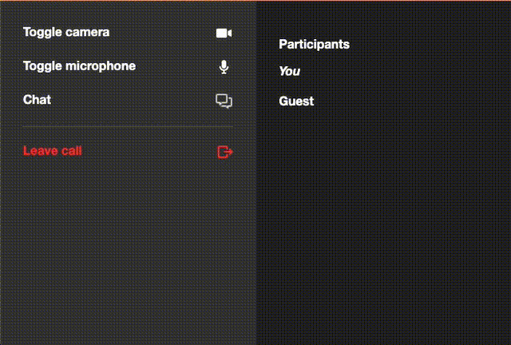

# Daily.co simple chat demo 
This demo mirrors Daily.co's [css-grid-demo](), modified to add a basic chat user interface. 

The chat makes use of the `sendAppMessage()` instance me
thod and the corresponding `app-message` event listener. 

## How the demo works 
When a participant types a message and clicks send, a function fires that adds that message to the participant's local display. The function also broadcasts a message to the other participants using Daily.co's [`sendAppMessage()`](https://docs.daily.co/reference#%EF%B8%8F-sendappmessage) instance method. `sendAppMessage` triggers the `app-message`event. A callback function on `app-message` updates the other participants' displays and changes the text of "Chat" in their menu bar to red. 

To learn more about how we built this, read our [blog post](). 

## Example 

## Running locally 
1. Make sure you've followed the [instructions at the []root of the daily-demos repo](https://github.com/daily-co/daily-demos)
2. `cd static-demos` 
3. `npm run start` or `npm run dev`
4. Then open your browser and go to `localhost:<port>/static-demos/simple-chat-demo/index.html`

## Contributing and feedback 
Let us know how experimenting with this demo goes! Feel free to [open an Issue](https://github.com/daily-co/daily-demos/issues), or reach us any time at `help@daily.co`. 
 
## What's next 
In this demo, chats do not persist. New callers who join a call are not able to see chat history. For more advanced chat features like this, stay tuned for tutorials on integrating Daily.co with third-party chat API's. 